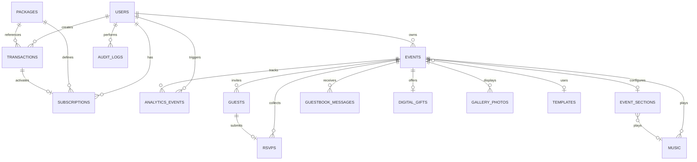

# Database Relationships

## Relationship Details

| Parent | Child | Type | FK Column | Cascade |
|--------|-------|------|-----------|---------|
| users | subscriptions | 1:N | user_id | CASCADE |
| users | transactions | 1:N | user_id | RESTRICT |
| users | events | 1:N | user_id | CASCADE |
| packages | subscriptions | 1:N | package_id | RESTRICT |
| packages | transactions | 1:N | package_id | RESTRICT |
| events | event_sections | 1:1 | event_id | CASCADE |
| events | guests | 1:N | event_id | CASCADE |
| events | rsvps | 1:N | event_id | CASCADE |
| events | guestbook_messages | 1:N | event_id | CASCADE |
| events | digital_gifts | 1:1 | event_id | CASCADE |
| events | gallery_photos | 1:N | event_id | CASCADE |
| events | music | 1:N | event_id | SET NULL |
| events | templates | N:1 | template_id | SET NULL |
| guests | rsvps | 1:1 | guest_id | CASCADE |
| transactions | subscriptions | 1:1 | transaction_id | SET NULL |

## Key Constraints

### UNIQUE constraints
- `users.email` (with soft delete filter)
- `users.phone` (with soft delete filter)
- `events.slug`
- `guests.token`
- `rsvps.guest_id`
- `digital_gifts.event_id`
- `event_sections.event_id`
- `packages.code`
- `transactions.order_id`

### CHECK constraints
> TODO: Add database-level check constraints.

### Foreign key behavior
- User deletion: cascade to subscriptions, events, guests, rsvps, guestbook.
- Event deletion: cascade to guests, rsvps, guestbook, gallery, music.
- Guest deletion: cascade to rsvp.

## Cascade Strategy

### CASCADE DELETE (safe)
- users → subscriptions (subscription lost on user delete — acceptable)
- users → events (events lost on user delete — admin can restore via backup)
- events → guests (guests belong to event)
- events → guestbook_messages
- events → gallery_photos
- guests → rsvps

### RESTRICT (prevent orphan)
- users → transactions (keep for audit)
- packages → subscriptions (don't delete referenced packages)
- packages → transactions

### SET NULL
- events → template (allow template deletion, event uses default)
- events → music (allow music deletion, music stops)

## Data Integrity Rules

1. A guest must belong to a valid event.
2. An RSVP must belong to a valid guest.
3. A guest can have at most one RSVP.
4. A transaction order_id must be unique.
5. An event slug must be globally unique.
6. A subscription must reference an existing package.
7. Digital gifts must belong to an event that is published.
8. Event sections are created automatically when an event is created.
9. Soft-deleted users keep their transactions for audit purposes.
